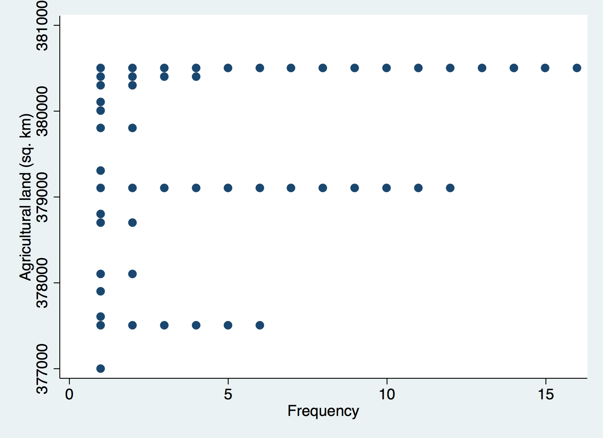
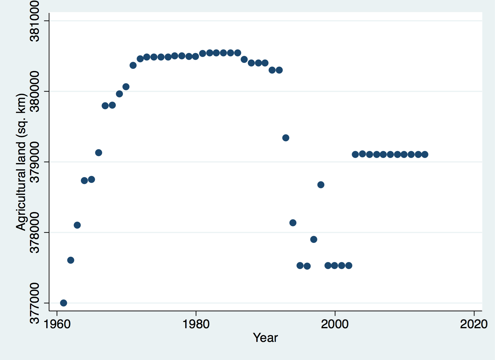

# Data

This data was downloaded from http://data.worldbank.org/country/afghanistan (Excel format) on December 22, 2016.

```{r}
## Read the data
library('readxl')
afg <- read_excel('API_AFG_DS2_en_excel_v2.xls', sheet = 1, skip = 3)

## Explore it a bit
dim(afg)
head(afg)
```


```{r}
## Reshape data and explore
afg_fix <- as.data.frame(t(afg[, -which(colnames(afg) %in% c('Country Name',
    'Country Code', 'Indicator Code', 'Indicator Name'))]))
colnames(afg_fix) <- afg$"Indicator Code"

## Fix colnames for stata
colnames(afg_fix) <- gsub('_|\\.', '', colnames(afg_fix))

## Add the year
afg_fix$Year <- 1960:2016

## Attach variable labels
attr(afg_fix, 'var.labels') <- c(afg$"Indicator Name", 'Year')

## Explore fixed version
dim(afg_fix)
head(afg_fix)
```

```{r}
## Export
library('rio')
export(afg_fix, 'afg_worldbank_2016.Rdata')

library('foreign')
write.dta(afg_fix, 'afg_worldbank_2016.dta')
```

# Stata

```{r}
library('knitr')
statapath <- '/Applications/Stata/Stata.app/Contents/MacOS/Stata'
```

Here are some Stata commands for exploring this data a bit:

```{r, engine = 'stata', engine.path = statapath, comment='', results = 'hide'}
use afg_worldbank_2016.dta, clear
```

```{r, engine = 'stata', engine.path = statapath, comment='', echo=2, results = 'hide'}
use afg_worldbank_2016.dta, clear
twoway scatter AGLNDAGRIK2 TXVALMRCHWRZS
graph export "scatter1.png", replace
```


```{r, engine = 'stata', engine.path = statapath, comment='', echo=2, results = 'hide'}
use afg_worldbank_2016.dta, clear
graph box AGLNDAGRIK2
graph export "box1.png", replace
```


```{r, engine = 'stata', engine.path = statapath, comment='', echo=2, results = 'hide'}
use afg_worldbank_2016.dta, clear
dotplot AGLNDAGRIK2
graph export "dot1.png", replace
```




```{r, engine = 'stata', engine.path = statapath, comment='', echo=2, results = 'hide'}
use afg_worldbank_2016.dta, clear
graph box TXVALMRCHWRZS
graph export "box2.png", replace
```


```{r, engine = 'stata', engine.path = statapath, comment='', echo=2, results = 'hide'}
use afg_worldbank_2016.dta, clear
dotplot TXVALMRCHWRZS
graph export "dot2.png", replace
```


```{r, engine = 'stata', engine.path = statapath, comment='', echo=2, results = 'hide'}
use afg_worldbank_2016.dta, clear
twoway scatter AGLNDAGRIK2 Year
graph export "scatter2.png", replace
```




# Reproducibility


Date this document was generated.

```{r reproduce_date, echo=FALSE}
## Date the vignette was generated
Sys.time()
```

`R` session information.

```{r reproduce_info, echo=FALSE}
## Session info
library('devtools')
options(width = 120)
session_info()
```

[](http://creativecommons.org/licenses/by-nc-sa/4.0/)
