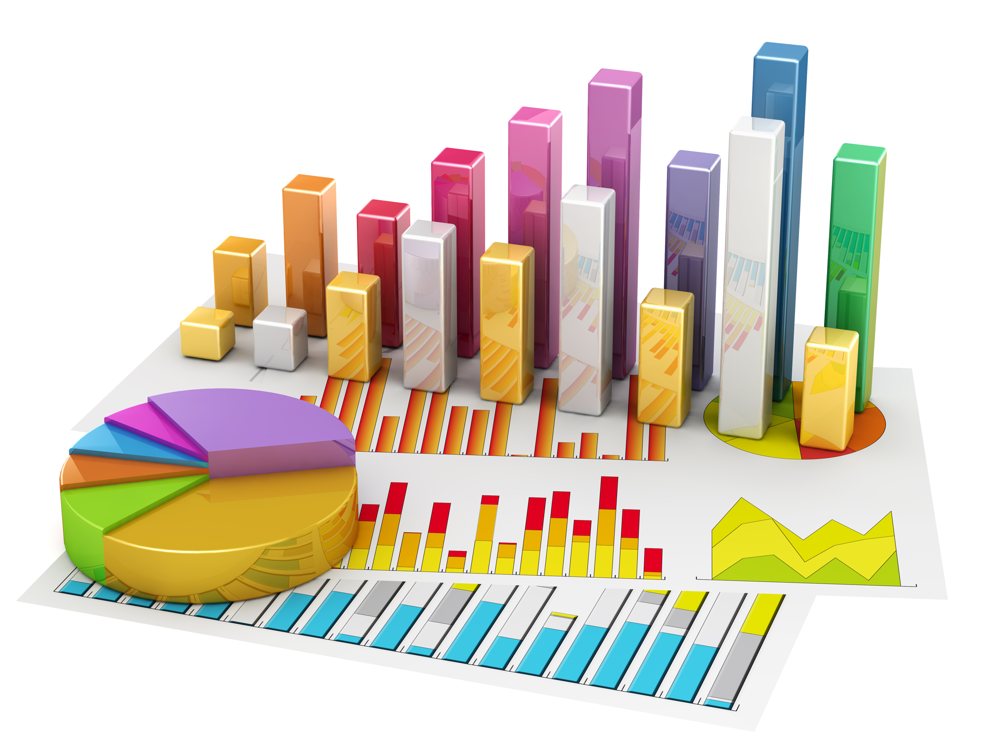

## What is Biostatistics?

```{r, echo = FALSE, results = 'hide'}
library('knitr')
statapath <- '/Applications/Stata/Stata.app/Contents/MacOS/Stata'
```

## Math?

```{r out.width = ifelse(opts_knit$get("rmarkdown.pandoc.to") == 'html', '600px', '90%'), echo = FALSE}
include_graphics("formula-for-2-sample-t.png")
```

[Source](https://ingenuechasesdenouement.files.wordpress.com/2015/02/formula-for-2-sample-t.png)

## Graphs?

```{r out.width = ifelse(opts_knit$get("rmarkdown.pandoc.to") == 'html', '600px', '90%'), echo = FALSE}

```

[Source](http://guides.lib.umich.edu/c.php?g=283434&p=2280144)

##

```{r out.width = ifelse(opts_knit$get("rmarkdown.pandoc.to") == 'html', '700px', '90%'), echo = FALSE}
include_graphics("1338293637042_1398822.png")
```

[Source](http://www.someecards.com/usercards/viewcard/MjAxMi0wM2IyMjc3ZGZlYjdhZGIy)

##

```{r out.width = ifelse(opts_knit$get("rmarkdown.pandoc.to") == 'html', '700px', '90%'), echo = FALSE}
include_graphics("correlation.png")
```

[Source](https://xkcd.com/552/)

##

```{r out.width = ifelse(opts_knit$get("rmarkdown.pandoc.to") == 'html', '700px', '90%'), echo = FALSE}
include_graphics("ppdac_complete_background.png")
```

[Source](https://learnandteachstatistics.wordpress.com/2015/07/27/the_islands/)

## Biostatistics

>* Theoretical mathematics: building blocks for other researchers
>* Applied math: use math to solve a problem like building an estimator
>* Biostatistics; using stats with biological data

## Brain imaging

```{r out.width = ifelse(opts_knit$get("rmarkdown.pandoc.to") == 'html', '400px', '90%'), echo = FALSE}

```

Check out [this interactive visualization](http://johnmuschelli.com/Neuroimaging_in_R/#32)!

[Source](https://elizabethmargaretsweeney.wordpress.com/2015/09/10/introducing-the-oasis-r-package-2/)

## Environmental Statistics

```{r out.width = ifelse(opts_knit$get("rmarkdown.pandoc.to") == 'html', '500px', '50%'), echo = FALSE}

```

[Source](http://link.springer.com/article/10.1007/s10651-015-0319-6)

## Genomics

```{r out.width = ifelse(opts_knit$get("rmarkdown.pandoc.to") == 'html', '600px', '90%'), echo = FALSE}

```

[Source](http://nar.oxfordjournals.org/content/early/2016/09/29/nar.gkw852)

## Activity trackers

```{r out.width = ifelse(opts_knit$get("rmarkdown.pandoc.to") == 'html', '700px', '90%'), echo = FALSE}

```

[Source](http://www.biostat.jhsph.edu/~jbai/research.html)


## Data Science overview

```{r out.width = ifelse(opts_knit$get("rmarkdown.pandoc.to") == 'html', '800px', '90%'), echo = FALSE}
include_graphics("tidy1.png")
```

[Source](https://ismayc.github.io/moderndiver-book/2-intro.html)

## Cleaning data

```{r out.width = ifelse(opts_knit$get("rmarkdown.pandoc.to") == 'html', '500px', '90%'), echo = FALSE}
include_graphics("22e0a9b.jpg")
```

[Source](https://www.linkedin.com/pulse/big-data-101-cleaning-script-fennel-aurora)

## One type of clean data: tidy data

```{r out.width = ifelse(opts_knit$get("rmarkdown.pandoc.to") == 'html', '600px', '90%'), echo = FALSE}

```

[Source](http://www.slideshare.net/jenniferbryan5811/cm005-intro-ggplot2)

## You'll learn Stata

```{r, engine = 'stata', engine.path = statapath, comment='', echo=1:4, results = 'hide'}
use afg_worldbank_2016.dta
twoway (scatter SPRURTOTLZG Year), /*
    */ title(Rural population growth over time) /*
    */ subtitle(Afghanisthan)
graph export "scatter1.png", replace
```

```{r out.width = ifelse(opts_knit$get("rmarkdown.pandoc.to") == 'html', '600px', '90%'), echo = FALSE}
include_graphics("scatter1.png")
```

## Modern biostatistician

>* Participates in the experimental design, that is the _question_ the team wants to answer
>* Is a full participant in the research
>* Learns how to _clean_ data
>* Models the data given the question of interest
>* Contributes in interpreting the data and suggesting the next steps

## Communicating results

>* Understand the main concepts so you can explain them: means understanding why we chose a particular method
>* Proper graphics
>* Interpretation of the results


## Dr. McGready

Lets take a look at how [John McGready](https://www.jhsph.edu/faculty/directory/profile/801/john-mcgready) introduces biostatistics

>* Open lecture 1 of the course _Statistical Reasoning I_

## Exercise

Divide in two teams and come up with a 2 minute overview of Biostatistics. Imagine that you will record a 2 minute video to get students excited about your Biostatistics course.

## Jeff Leek Data Analysis intro


<iframe width="853" height="480" src="https://www.youtube.com/embed/nnQTT39ADPo" frameborder="0" allowfullscreen></iframe>

[Source](https://www.youtube.com/embed/nnQTT39ADPo)

## Slides license

[](http://creativecommons.org/licenses/by-nc-sa/4.0/)

