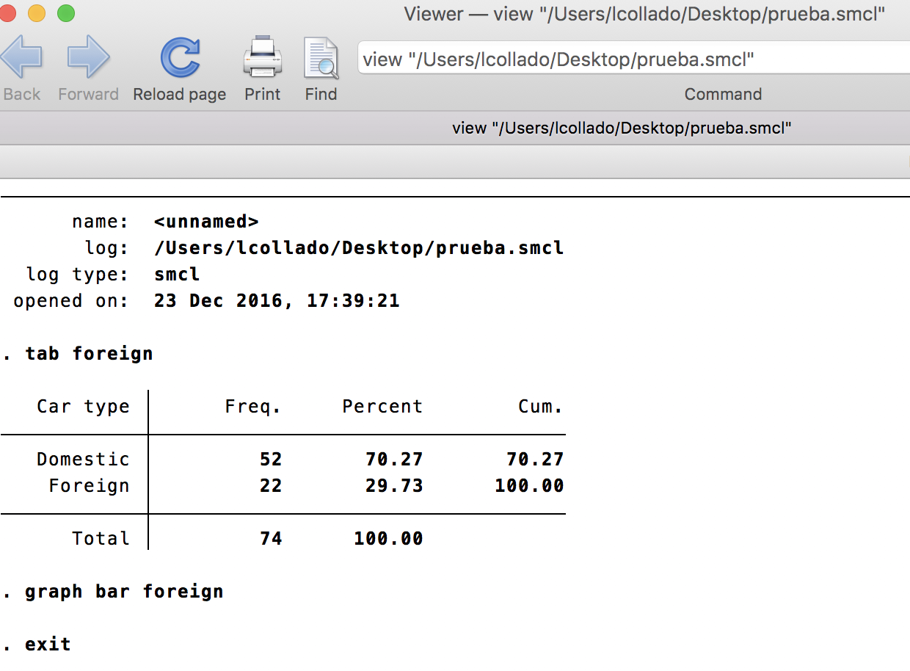
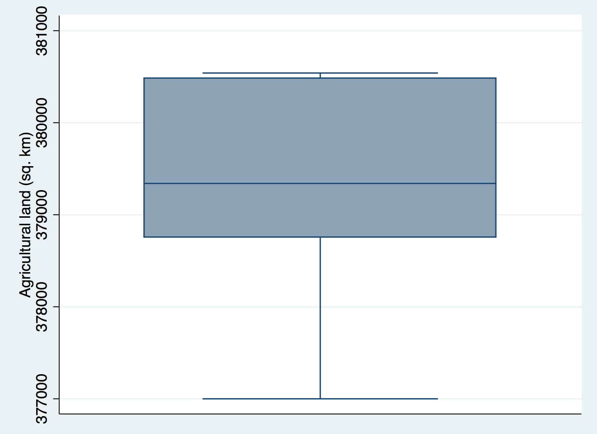

## 

```{r, echo = FALSE, results = 'hide'}
library('knitr')
statapath <- '/Applications/Stata/Stata.app/Contents/MacOS/Stata'
```

>* Have you heard about Stata?

## What is Stata?

>* Statistical software
>* Has a user interface _and_ code
>* Most statistical methods are implemented
>* It's licensed software, so it's not free

## Why Stata?

>* User interface: means users do not need to know how to write code
>* It is great for mixed models, survey data analysis, etc
>* Can be used for reproducible work via _do_ files
>* Researchers can contribute their modules: there's even a Stata journal

## Main components

* Data browser
    - View your data
    - _Can_ edit but not recommended

>* Help files: very detailed and interconnected
>* Can import data from many file types
>* Intuitive menu
>* Console: shows the latest code
>* Log: shows the latest results
>* _do_ file editor: make your work reproducible


## {.build}

Are you ready to start using Stata?

First, type the following command (or copy paste it)

```{r, engine = 'stata', engine.path = statapath, eval = FALSE}
sysuse autos
```

What do you get?


##

```{r, engine = 'stata', engine.path = statapath, comment=''}
sysuse autos
```

## {.build}

So, what went wrong?

Lets see if the error message gives us a hint as to what could have gone wrong.

```
The filename you specified cannot be found.  Perhaps you
mistyped the name, or it may be on another CDor directory.
```

Ohh, it could be that we incorrectly typed the name! Try this next:


```{r, engine = 'stata', engine.path = statapath, comment='', results = 'hide'}
sysuse auto
```

## Now lets explore the data

```{r out.width = ifelse(opts_knit$get("rmarkdown.pandoc.to") == 'html', '700px', '90%'), echo = FALSE}

```

## Command review

```{r out.width = ifelse(opts_knit$get("rmarkdown.pandoc.to") == 'html', '700px', '90%'), echo = FALSE}

```

## Basic syntax {.build}

What do you want to do?

* Described by an action
* Think of it as a __verb__
* For example, load a data set included in Stata with `sysuse`

What are you going to use for that action?

* That's the actual data that you will use
* Think of it as the __subject__
* For example, the `auto` data set

## Keep track of your work

>* Do you remember all the options in a user interface you used 6 months ago?
>* It's important to keep track of your work!
>* Useful when learning so you can revisit what you did: see what worked, what didn't
>* Two main options in Stata: log files and do files

## Log files {.build}

These files keep track of everything: 

>* The commands you used
>* The commands that specify what you did with the user interface
>* The output you generated: tables, results
>* They do not save images

Start a log for our session

## Example log file

```{r out.width = ifelse(opts_knit$get("rmarkdown.pandoc.to") == 'html', '700px', '90%'), echo = FALSE}

```


## Do files

>* These files contain commands only
>* They are an executive summary of what you did
>* Great for analyses you want to share
>* You can include comments describing the logic of what you are doing
>* You can _execute_ them to run commands
>* Cleaner than _log_ files.
>* Open the do file and paste the command to load the `auto` data set.

## Example do file

```{r out.width = ifelse(opts_knit$get("rmarkdown.pandoc.to") == 'html', '800px', '90%'), echo = FALSE}

```


##  Exercise {.build}

Use the Afghanistan data from the Worldbank and make a plot of the agricultural land (in squared kilometers).

Start by loading the data!

## No cheating!!!

Don't look at the next slides! Try first!

## What variable is it? {.build}

```{r out.width = ifelse(opts_knit$get("rmarkdown.pandoc.to") == 'html', '700px', '90%'), echo = FALSE}

```

It's AGLNDAGRIK2

##

```{r, engine = 'stata', engine.path = statapath, comment='', echo=1:2, results = 'hide'}
use afg_worldbank_2016.dta, clear
graph box AGLNDAGRIK2
graph export "box1.png", replace
```

```{r out.width = ifelse(opts_knit$get("rmarkdown.pandoc.to") == 'html', '700px', '90%'), echo = FALSE}

```

## {.build}

Looks pretty easy, right? Just 2 lines of code. 

```{r out.width = ifelse(opts_knit$get("rmarkdown.pandoc.to") == 'html', '700px', '90%'), echo = FALSE}

```

The original data was a bit more messy! Transforming it to something we can use is called _data cleaning_ or _data tidying_.


## Stata syntax: options

>* Many Stata commands have options that give us more fine tuned control over what we want to do
>* You can find them also via the user interface: many are checkboxes
>* Think of options as __adjectives__
>* Examples: title of a graph, which data to use, colors
>* They normally come after a comma
>* You can find the options in the Stata help

## Options example

```{r, engine = 'stata', engine.path = statapath, comment='', echo=1:2, results = 'hide'}
use "HH Listing.dta"
graph box q105 if q103 == 1, by(q104)
graph export "box2.png", replace
```

```{r out.width = ifelse(opts_knit$get("rmarkdown.pandoc.to") == 'html', '600px', '90%'), echo = FALSE}

```


##

```{r, engine = 'stata', engine.path = statapath, comment='', echo=2:4, results = 'hide'}
use "HH Listing.dta"
graph box q105 if q103 == 1,ytitle(Age of Head of Household)/*
    */ by(, title(Age of Head of Household by Gender) /*
	*/ subtitle(Afghanistan)) by(q104)
graph export "box3.png", replace
```

```{r out.width = ifelse(opts_knit$get("rmarkdown.pandoc.to") == 'html', '600px', '90%'), echo = FALSE}

```

## Stata help

>* It comes in two shapes: help pages for commands and PDF documents
>* Help pages are more direct
>* Sometimes it's easier to scroll down to the examples section
>* The help pages are interconnected, so use the hyperlinks
>* Check out the help page for graph box: `help graph box`

## Exercise continued

Improve the plot you made earlier as if you were to show the distribution of the agricultural land of Afghanistan in the media (news) or a journal.

##

```{r, engine = 'stata', engine.path = statapath, comment='', echo=2:3, results = 'hide'}
use afg_worldbank_2016.dta, clear
graph hbox AGLNDAGRIK2, title(Afghanistan agricultural land) /*
    */ subtitle(1961 to 2013) note(Worldbank 2016) scheme(sj)
graph export "box1_pretty.png", replace
```

```{r out.width = ifelse(opts_knit$get("rmarkdown.pandoc.to") == 'html', '600px', '90%'), echo = FALSE}

```

## See all the entries for a variable: list {.smaller}

```{r, engine = 'stata', engine.path = statapath, comment='', echo=2}
use afg_worldbank_2016.dta, clear
list AGLNDAGRIK2
```

## codebook: main information {.smaller}

```{r, engine = 'stata', engine.path = statapath, comment='', echo=2}
use afg_worldbank_2016.dta, clear
codebook AGLNDAGRIK2
```

## summarize: univariate statistical summary

```{r, engine = 'stata', engine.path = statapath, comment='', echo=2}
use afg_worldbank_2016.dta, clear
summarize AGLNDAGRIK2
```

## {.smaller}

```{r, engine = 'stata', engine.path = statapath, comment='', echo=2}
use afg_worldbank_2016.dta, clear
summarize AGLNDAGRIK2, detail
```

## describe: similar to `codebook`

```{r, engine = 'stata', engine.path = statapath, comment='', echo=2}
use afg_worldbank_2016.dta, clear
describe AGLNDAGRIK2
```

## tabulate: make a table{.smaller}

```{r, engine = 'stata', engine.path = statapath, comment='', echo=2}
use afg_worldbank_2016.dta, clear
tabulate AGLNDAGRIK2
```

## tabulate: include missing observations {.smaller}

```{r, engine = 'stata', engine.path = statapath, comment='', echo=2}
use afg_worldbank_2016.dta, clear
tabulate AGLNDAGRIK2, missing
```

## count number of observations

```{r, engine = 'stata', engine.path = statapath, comment='', echo=2}
use afg_worldbank_2016.dta, clear
count if AGLNDAGRIK2 == .
```

## generate: create a new variable

```{r, engine = 'stata', engine.path = statapath, comment='', echo=2}
use afg_worldbank_2016.dta, clear
generate agrilog = log10(AGLNDAGRIK2)
summarize agrilog
```

## drop: delete variables

```{r, engine = 'stata', engine.path = statapath, comment='', echo=3}
use afg_worldbank_2016.dta, clear
generate agrilog = log10(AGLNDAGRIK2)
drop agrilog
```

You can use `keep` if the list of variables you want to retain is shorter than the list of variables you want to delete.

## _Tougher_ exercise {.build}

Calculate a t-test for a difference in means for the agricultural land between the even and the odd years.

Tip: remember that in math the modulus 2 is 0 for even values and 1 for odd values.

## {.smaller}

```{r, engine = 'stata', engine.path = statapath, comment='', echo = FALSE}
use afg_worldbank_2016.dta
generate modulus = mod(Year, 2)
label define moduluslabel 0 "Even" 1 "Odd"
label values modulus moduluslabel
ttest AGLNDAGRIK2, by(modulus)
```


## Some _common_ complicated tasks

>* Reshaping data sets: wide to long and viceversa
>* Merging data sets: Stata ultimately wants you to get all the data you need in a single table
>* Looping over a list to do a task
>* Working with strings
>* Working with dates: there are many different ways to specify time

## Finding help

>* Try using the user interface then check the code that results from your choices
>* Use the `help` command or search the help (top right)
>* Google: lots of goodies in older mailing list posts
>* Check the [UCLA Stata](http://www.ats.ucla.edu/stat/stata/) website


## More information

* The _Statistics with Stata_ by Lawrence Hamilton you already have!
* A [quick rundown](http://www.cpc.unc.edu/research/tools/data_analysis/statatutorial) of the main commands in Stata by the UNC Caroline Population Center
* A [recording](https://connect.johnshopkins.edu/p4byu038nuc/) of an introduction to Stata by Dr Marie Diener-West
* [SPSS to Stata](http://www.ats.ucla.edu/stat/stata/faq/spss_command_to_stata.htm) table
* [UCLA Stata Starter Kit](http://www.ats.ucla.edu/stat/stata/sk/default.htm)

## Slides license

[](http://creativecommons.org/licenses/by-nc-sa/4.0/)
