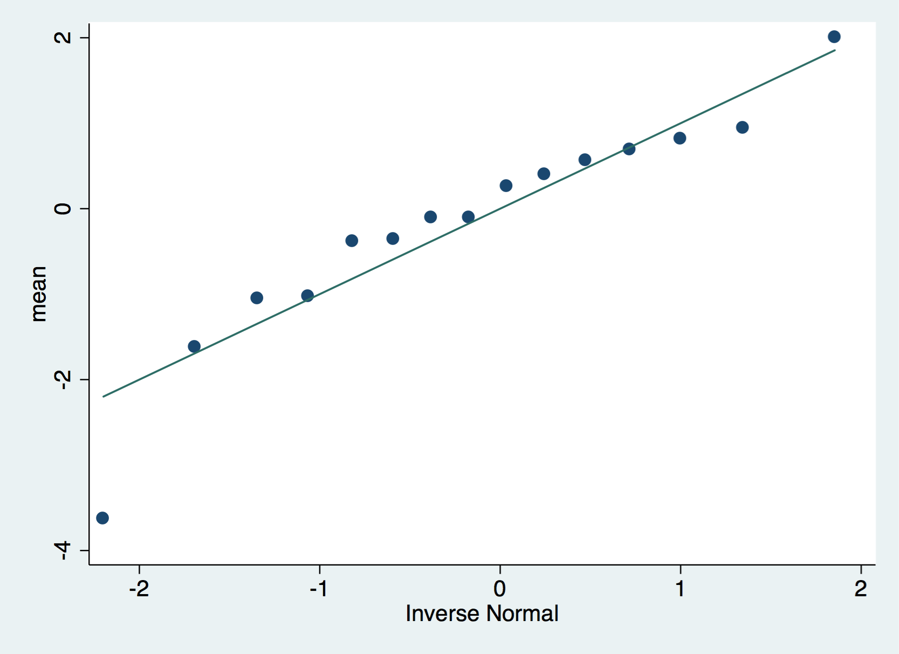

In this exercise we will use data from the Normal distribution. It's the main distribution used in Statistics and has important properties such as symmetry around the mean and it's bell shape. This exercise shows this distribution by building upon the exploratory data analysis graphics and commands that we learned previously. Then we will use data to learn properties of the sample distribution and the Central Limit Theorem.

# Variables in this data set

| name | description |
| ---- | -------------- |
| observation | An observation from the Normal distribution |
| size | The number of observations in the sample |
| variance | Variance of the Normal distribution |
| group | The group identifier for a given size and variance. There are 15 groups for each size and variance |

# Normal distribution

First lets learn about the Normal distribution using graphics from Exploratory Data Analysis. Complete the following tasks:

1. Load the file [normal_2016.dta](../data/normal_2016.data) into Stata.
1. Which are the unique `variance` values?
1. How many observations do we have for each unique `variance`?
1. What is the sum of the unique `size` values?
1. Plot the distribution of the `observation` variable. Does it look bell shaped?
1. Plot the distribution of the `observation` variable separately for each value of the `variance` variable. Does these plots look different to the previous one? What properties do you observe?
1. Compare the distribution of the `observation` variable against the theoretical Normal distribution. What would you conclude from this `qnorm` plot?
1. Make a separate `qnorm` plot for only the observations with variance equal to 1 (or 5 or 10). Does it look closer to the theoretical Normal distribution?

## Solutions

```{r}
library('knitr')
statapath <- '/Applications/Stata/Stata.app/Contents/MacOS/Stata'
```

```{r, engine = 'stata', engine.path = statapath, comment=''}
* Load the data
use normal_2016.dta, clear

* Unique variance values
codebook variance

* Observations for each unique variance
codebook variance

* Sum of the unique size values
codebook observation
* 5 + 15 + 25 + 100 = 145
* Note 145 * 15 = 2175

* Distribution of observation
histogram observation
graph export "hist1.png", replace
graph box observation
graph export "box1.png", replace

* Separately
histogram observation, by(variance)
graph export "hist2.png", replace
graph box observation, by(variance)
graph export "box2.png", replace

* Global qnorm
qnorm observation
graph export "qnorm1.png", replace

* For each variance
qnorm observation if variance == 1
graph export "qnorm-var1.png", replace
qnorm observation if variance == 5
graph export "qnorm-var5.png", replace
qnorm observation if variance == 10
graph export "qnorm-var10.png", replace
```


# Sampling

1. Load the file [normal_2016.dta](../data/normal_2016.data) into Stata.
1. What is the standard deviation of the `observation` variable?
1. What is the standard deviation of the `observation` variable when `variance` is equal to 1? Is it equal to 1? If not, how close is it to 1?
1. Repeat the same process for each unique value of the `group` variable when `variance` is equal to 1. Are the means equal to 0? Are the standard deviations equal to 1? What differences do you notice with respect to the previous bullet point?

To differentiate the properties of the sample distribution and the theoretical distribution, we say that:

* $\mu$ is the mean of the theoretical distribution
* $\sigma$ is the standard deviation of the theoretical distribution
* $\bar{x}$ is the mean of the sample distribution, also known as the _sample mean_
* $s = \sqrt{\frac{\sum (x_i - \bar{x})^2 }{n - 1}}$ is the standard deviation of the sample distribution


## Solutions

```{r, engine = 'stata', engine.path = statapath, comment=''}
* Load the data
use normal_2016.dta, clear

* SD of observation
summarize observation

* SD of observation when variance is equal to 1
summarize observation if variance == 1

* SD of observation when variance is equal to 1 for each group
bys group: summarize observation if variance == 1
```

# Central Limit Theorem

In many applications of biostatistics we study the _sample mean_ and the Central Limit Theorem (a theoretical result) provides us with a incredibly powerful tool. The CLT tells us that as the sample size $n$ increases, the distribution of the sample mean $bar{x}$ gets closer to the Normal distribution with mean $\mu$ and variance $\frac{s}{\sqrt{n}}$. 

This sounds great, but lets see it in action. Complete the following tasks:

1. Load the file [normal_2016.dta](../data/normal_2016.data) into Stata.
1. For each group of observations that have sample size equal to 5 and variance 10, calculate the mean. Open a text editor or Excel and write down the 15 sample means in column 1 (name it mean) and write 5 as the sample size in the second column (name it size).
1. Repeat this process for each group of observations that have sample size equal to 15 and variance 10. Add the means to the same table from the previous step.
1. Repeat this process for each group of observations that have sample size equal to 25 and variance 10.
1. Repeat this process for each group of observations that have sample size equal to 100 and variance 10.

That is fill out the following table.
 
 
| mean | size |
| ---- | ---- |
| | 5 |
| | 5 |
| | 5 |
| | 5 |
| | 5 |
| | 5 |
| | 5 | 
| | 5 |
| | 5 |
| | 5 |
| | 5 |
| | 5 |
| | 5 |
| | 5 |
| | 5 |
| | 15 |
| | 15 |
| | 15 |
| | 15 |
| | 15 |
| | 15 |
| | 15 | 
| | 15 |
| | 15 |
| | 15 |
| | 15 |
| | 15 |
| | 15 |
| | 15 |
| | 15 |
| | 25 |
| | 25 |
| | 25 |
| | 25 |
| | 25 |
| | 25 |
| | 25 | 
| | 25 |
| | 25 |
| | 25 |
| | 25 |
| | 25 |
| | 25 |
| | 25 |
| | 25 |
| | 100 |
| | 100 |
| | 100 |
| | 100 |
| | 100 |
| | 100 |
| | 100 | 
| | 100 |
| | 100 |
| | 100 |
| | 100 |
| | 100 |
| | 100 |
| | 100 |
| | 100 |

6. Save your new table and import it with Stata. Alternatively use [sample_means_2016.txt](sample_means_2016.txt).
7. Plot the distribution of the sample mean separately for each unique sample size (_size_ variable). What happens to the distribution of the sample mean as you increase the sample size?
8. You can optionally repeat this process for the observations drawn from a Normal distribution with variance 1 or 5 (don't mix them!). Can be useful too if you have a large class and want to divide them into 3.

## Solutions

```{r, engine = 'stata', engine.path = statapath, comment=''}
* Load the data
use normal_2016.dta, clear

* Calculate the means but then register them manually
bys group: summarize observation if variance == 10 & size == 5
bys group: summarize observation if variance == 10 & size == 15
bys group: summarize observation if variance == 10 & size == 25
bys group: summarize observation if variance == 10 & size == 100

* Calculate the means with programatic code (this is called looping)
* and save the results to the sample_means_2016.txt file.
* For moe details to understand this code check 
* http://www.ats.ucla.edu/stat/stata/faq/filewrite.htm
file open myresults using "sample_means_2016.txt", write replace
file write myresults "mean" _tab "size" _n
set more off
foreach samplesize of numlist 5 15 25 100 {
    foreach groupid of numlist 1 2 3 4 5 6 7 8 9 10 11 12 13 14 15 {
        summarize observation if variance == 10 & size == `samplesize' & group == `groupid'
        file write myresults (r(mean)) _tab "`samplesize'" _n
    }
}
file close myresults
set more on


* Load the sample means table
import delimited "sample_means_2016.txt", clear

* Make the graphics
histogram mean, by(size)
graph export "hist3.png", replace
graph box mean, by(size)
graph export "box3.png", replace

* Optional qnorm plots
qnorm mean if size == 5
graph export "qnorm_mean_size5.png", replace
qnorm mean if size == 15
graph export "qnorm_mean_size15.png", replace
qnorm mean if size == 25
graph export "qnorm_mean_size25.png", replace
qnorm mean if size == 100
graph export "qnorm_mean_size100.png", replace
```





[](http://creativecommons.org/licenses/by-nc-sa/4.0/)